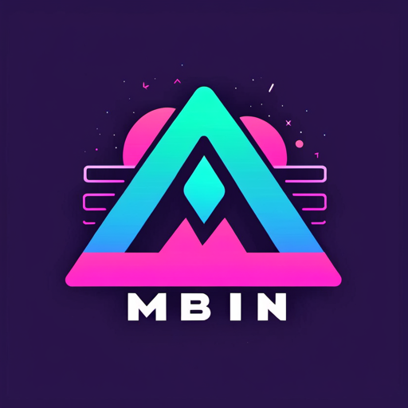

# Mbin

Mbin is a fork of [/kbin](https://codeberg.org/Kbin/kbin-core), community-focused. Feel free to discuss on [Matrix](https://matrix.to/#/#mbin:melroy.org) and to create Pull Requests.

> [!Important]
> Mbin is focused on what the community wants, pull requests can be merged by any repo maintainer (with merge rights in GitHub). Discussions take place on [Matrix](https://matrix.to/#/#mbin:melroy.org) then _consensus_ has to be reached by the community. If approved by the community, only one approval on the PR is required by one of the Mbin maintainers. It's built entirely on trust.

Mbin is a decentralized content aggregator, voting, discussion and microblogging platform running on the fediverse network. It can
communicate with many other ActivityPub services, including Kbin, Mastodon, Lemmy, Pleroma, Peertube. The initiative aims to
promote a free and open internet.

Unique Features of Mbin for server owners & users alike:

- Tons of **[GUI improvements](https://github.com/MbinOrg/mbin/pulls?q=is%3Apr+is%3Amerged+label%3Afrontend)**
- A lot of **[enhancements](https://github.com/MbinOrg/mbin/pulls?q=is%3Apr+is%3Amerged+label%3Aenhancement)**
- Various **[bug fixes](https://github.com/MbinOrg/mbin/pulls?q=is%3Apr+is%3Amerged+label%3Abug)**
- Support of **all** ActivityPub Actor Types (including also "Service" account support; thus support for robot accounts)
- **Up-to-date** PHP packages and **security/vulnerability** issues fixed
- Support for `application/json` Accept request header on all ActivityPub end-points
- Introducing a hosted documentation: [docs.joinmbin.org](https://docs.joinmbin.org)

See also: [all merged PRs](https://github.com/MbinOrg/mbin/pulls?q=is%3Apr+is%3Amerged) or [our releases](https://github.com/MbinOrg/mbin/releases).

For developers:

- Improved [bare metal/VM guide](https://docs.joinmbin.org/admin/installation/bare_metal) and [Docker guide](https://docs.joinmbin.org/admin/installation/docker/)
- [Improved Docker setup](https://github.com/MbinOrg/mbin/pulls?q=is%3Apr+is%3Amerged+label%3Adocker)
- _Developer_ server explained (see [Development Server documentation here](https://docs.joinmbin.org/contributing/development_server) )
- GitHub Security advisories, vulnerability reporting, [Dependabot](https://github.com/features/security) and [Advanced code scanning](https://docs.github.com/en/code-security/code-scanning/introduction-to-code-scanning/about-code-scanning) enabled. And we run [`local-php-security-checker`](https://github.com/fabpot/local-php-security-checker).
- Improved **code documentation**
- **Tight integration** with [Mbin Weblate project](https://hosted.weblate.org/engage/mbin/) for translations (Two way sync)
- Last but not least, a **community-focus project embracing the Collective Code Construction Contract** (C4). No single maintainer.

## Instances

- [List of instances](https://fedidb.org/software/mbin)
- [Alternative listing of instances](https://mbin.fediverse.observer/list)

## Star History

## Contributing

- [Official repository on GitHub](https://github.com/MbinOrg/mbin)
- [Matrix Space for discussions](https://matrix.to/#/#mbin:melroy.org)
- [Unofficial magazine for discussions within the fediverse](https://kbin.run/m/Mdev)
- [Translations](https://hosted.weblate.org/engage/mbin/)
- [Contribution guidelines](CONTRIBUTING.md) - please read first, including before opening an issue!

## Contributors

<!-- readme: contributors -start -->
<table>
	<tbody>
		<tr>
            <td align="center">
                <a href="https://github.com/ernestwisniewski">
                    
                     
                    <b>Ernest</b>
                </a>
            </td>
            <td align="center">
                <a href="https://github.com/melroy89">
                    
                     
                    <b>Melroy van den Berg</b>
                </a>
            </td>
            <td align="center">
                <a href="https://github.com/e-five256">
                    
                     
                    <b>e-five</b>
                </a>
            </td>
            <td align="center">
                <a href="https://github.com/asdfzdfj">
                    
                     
                    <b>asdfzdfj</b>
                </a>
            </td>
            <td align="center">
                <a href="https://github.com/SzymonKaminski">
                    
                     
                    <b>SzymonKaminski</b>
                </a>
            </td>
            <td align="center">
                <a href="https://github.com/BentiGorlich">
                    
                     
                    <b>BentiGorlich</b>
                </a>
            </td>
		</tr>
		<tr>
            <td align="center">
                <a href="https://github.com/nobodyatroot">
                    
                     
                    <b>debounced</b>
                </a>
            </td>
            <td align="center">
                <a href="https://github.com/cooperaj">
                    
                     
                    <b>Adam Cooper</b>
                </a>
            </td>
            <td align="center">
                <a href="https://github.com/simonrcodrington">
                    
                     
                    <b>Simon Codrington</b>
                </a>
            </td>
            <td align="center">
                <a href="https://github.com/weblate">
                    
                     
                    <b>Weblate (bot)</b>
                </a>
            </td>
            <td align="center">
                <a href="https://github.com/kkoyung">
                    
                     
                    <b>Kingsley Yung</b>
                </a>
            </td>
            <td align="center">
                <a href="https://github.com/TheVillageGuy">
                    
                     
                    <b>TheVillageGuy</b>
                </a>
            </td>
		</tr>
		<tr>
            <td align="center">
                <a href="https://github.com/danielpervan">
                    
                     
                    <b>Daniel Pervan</b>
                </a>
            </td>
            <td align="center">
                <a href="https://github.com/Ahrotahn">
                    
                     
                    <b>Ahrotahn</b>
                </a>
            </td>
            <td align="center">
                <a href="https://github.com/GauthierPLM">
                    
                     
                    <b>Gauthier POGAM--LE MONTAGNER</b>
                </a>
            </td>
            <td align="center">
                <a href="https://github.com/CocoPoops">
                    
                     
                    <b>CocoPoops</b>
                </a>
            </td>
            <td align="center">
                <a href="https://github.com/thepaperpilot">
                    
                     
                    <b>Anthony Lawn</b>
                </a>
            </td>
            <td align="center">
                <a href="https://github.com/chall8908">
                    
                     
                    <b>Chris Hall</b>
                </a>
            </td>
		</tr>
		<tr>
            <td align="center">
                <a href="https://github.com/andrewmoise">
                    
                     
                    <b>andrewmoise</b>
                </a>
            </td>
            <td align="center">
                <a href="https://github.com/garrettw">
                    
                     
                    <b>Garrett W.</b>
                </a>
            </td>
            <td align="center">
                <a href="https://github.com/piotr-sikora-v">
                    
                     
                    <b>Piotr Sikora</b>
                </a>
            </td>
            <td align="center">
                <a href="https://github.com/lilfade">
                    
                     
                    <b>Bryson</b>
                </a>
            </td>
            <td align="center">
                <a href="https://github.com/vpzomtrrfrt">
                    
                     
                    <b>vpzomtrrfrt</b>
                </a>
            </td>
            <td align="center">
                <a href="https://github.com/cavebob">
                    
                     
                    <b>cavebob</b>
                </a>
            </td>
		</tr>
		<tr>
            <td align="center">
                <a href="https://github.com/drupol">
                    
                     
                    <b>Pol Dellaiera</b>
                </a>
            </td>
            <td align="center">
                <a href="https://github.com/ryanmonsen">
                    
                     
                    <b>ryanmonsen</b>
                </a>
            </td>
            <td align="center">
                <a href="https://github.com/WebVoid">
                    
                     
                    <b>Webvoid</b>
                </a>
            </td>
            <td align="center">
                <a href="https://github.com/comradekingu">
                    
                     
                    <b>Allan Nordhøy</b>
                </a>
            </td>
            <td align="center">
                <a href="https://github.com/CSDUMMI">
                    
                     
                    <b>CSDUMMI</b>
                </a>
            </td>
            <td align="center">
                <a href="https://github.com/privacyguard">
                    
                     
                    <b>privacyguard</b>
                </a>
            </td>
		</tr>
	<tbody>
</table>
<!-- readme: contributors -end -->

## Getting Started

### Documentation

See [docs.joinmbin.org](https://docs.joinmbin.org)

### Requirements

[See also Symfony requirements](https://symfony.com/doc/current/setup.html#technical-requirements)

- PHP version: 8.2 or higher
- GD or Imagemagick PHP extension
- NGINX / Apache / Caddy
- PostgreSQL
- RabbitMQ
- Redis / KeyDB
- Mercure (optional)

## Languages

Following languages are currently supported/translated:

- Bulgarian
- Chinese
- Danish
- Dutch
- English
- Esperanto
- Filipino
- French
- Galician
- German
- Greek
- Italian
- Japanese
- Polish
- Portuguese
- Portuguese (Brazil)
- Russian
- Spanish
- Turkish
- Ukrainian

## Credits

- [grumpyDev](https://karab.in/u/grumpyDev): icons, kbin-theme
- [Emma](https://codeberg.org/LItiGiousemMA/Postmill): Postmill
- [Ernest](https://github.com/ernestwisniewski): Kbin

## License

[AGPL-3.0 license](LICENSE)
