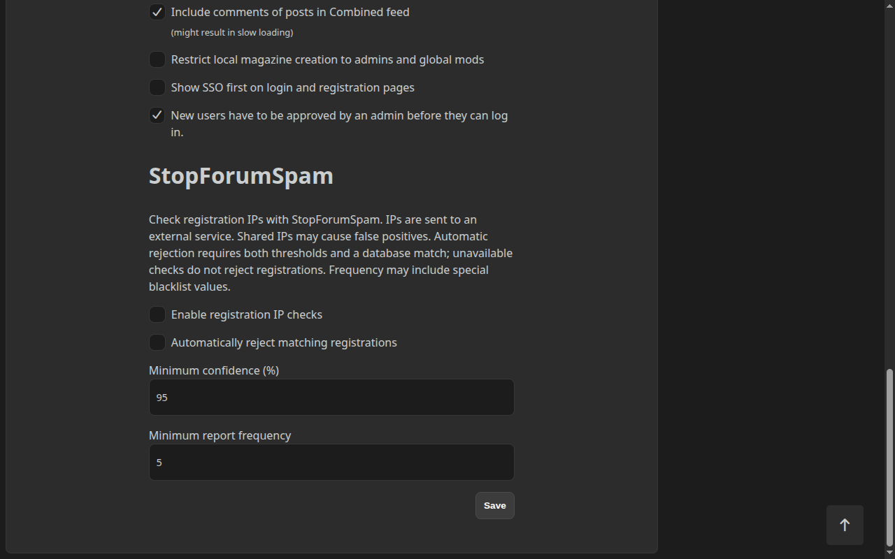
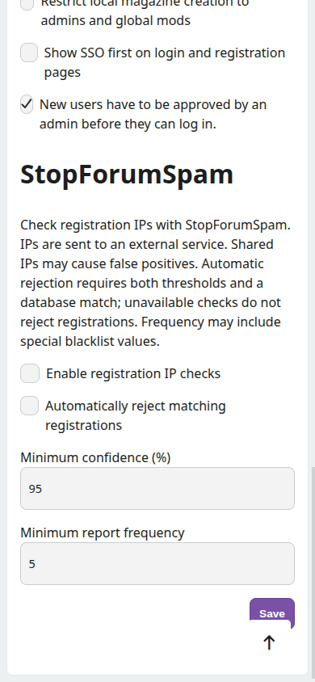
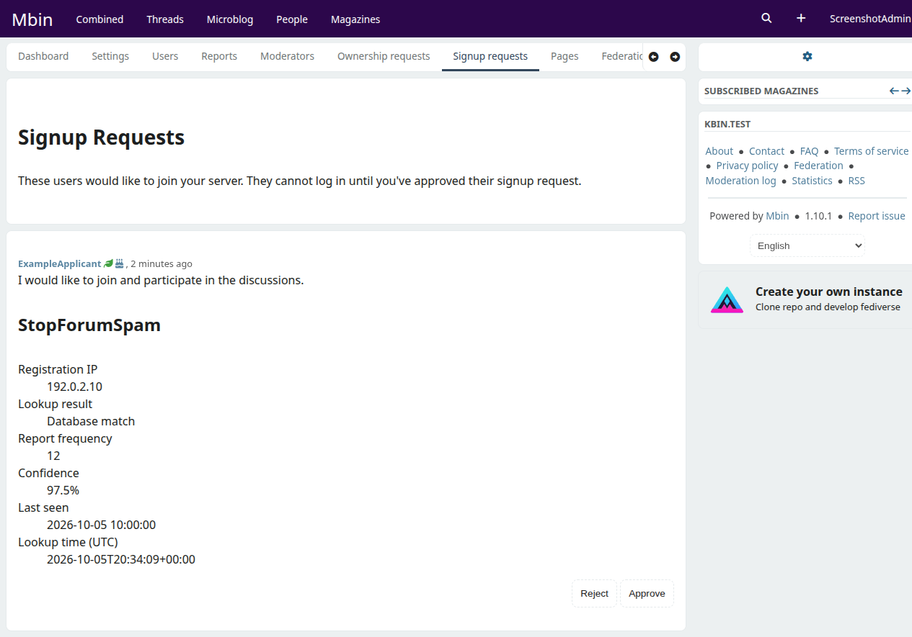

# StopForumSpam registration screening

In `/admin/settings`, enable **Enable registration IP checks** to screen password and SSO signups. Both lookup and automatic rejection are disabled by default. Existing logins, linked accounts, operator-created accounts, and federated users are not screened.

With **Automatically reject matching registrations** enabled, registration is rejected before account creation only when StopForumSpam reports a match and both thresholds are met. The defaults are **95% confidence** and **frequency 5**. Administrators can change either threshold; equal values meet the threshold. Missing confidence never triggers rejection.

Confidence is the provider's reputation score, not a guarantee. Shared addresses can produce false positives. Frequency includes special blacklist values such as 255 and is not always a literal count of reports. Mbin does not request automatic Tor-exit blocking.

## Approval review and email

When manual user approval is enabled, the signup request shows the IP, lookup result, frequency, confidence, last-seen date, and lookup time. Administrators with signup notifications enabled also receive an approval-request email. Moderators retain their existing in-app notifications. The email links to the authenticated review page; approval still requires an explicit action there.

Only pending applications retain the screening snapshot. Approval, rejection, or deletion clears it. Existing applications are not backfilled. Delivered emails remain in recipients' mailboxes. Queued approval emails are skipped if screening has been disabled or the application has been resolved.

## IP and privacy setup

Only the registration IP is sent to [StopForumSpam](https://www.stopforumspam.com/usage), through HTTPS POST. No username or email is included in the lookup. Include this external processing in your instance's privacy information when enabling the feature.

Configure `TRUSTED_PROXIES` for your actual reverse proxies. Public signup checks use Symfony's trusted `X-Forwarded-For` handling. If using Cloudflare or Fastly, configure the edge/origin proxy to validate and translate its client-IP header into trusted forwarding information; arbitrary CDN headers sent directly to Mbin are not used for signup checks. Ensure the origin cannot be reached through an untrusted path that preserves spoofed forwarding headers.

## Availability and operation

Lookups have a three-second deadline and no retries. Successful results are cached for 15 minutes, unavailable results for one minute; cache keys use an HMAC of the canonical IP. Cache entries containing the result expire independently of pending applications. Threshold changes apply to cached results immediately.

Provider errors, missing IPs, and exhausted lookup quota allow registration to continue under the normal approval policy, with the result marked unavailable. A shared limiter permits at most 90,000 outbound lookups per 24-hour sliding window; StopForumSpam documents a limit of 100,000 per day. Avoid sharing this quota with other clients without allowing additional headroom.

Start with lookup enabled and automatic rejection disabled. Review results before enabling rejection. Disabling lookup also disables automatic rejection. Logs report unavailable checks and rejections without including raw registration IPs or provider response bodies.

Apply the database migration before running the new application and restart Messenger workers as part of deployment. Existing accounts remain unchanged.

## Screenshots

These examples use a fictional account and reserved example IP. The approval result is illustrative test data.

### Desktop settings

### Mobile settings

### Signup approval

