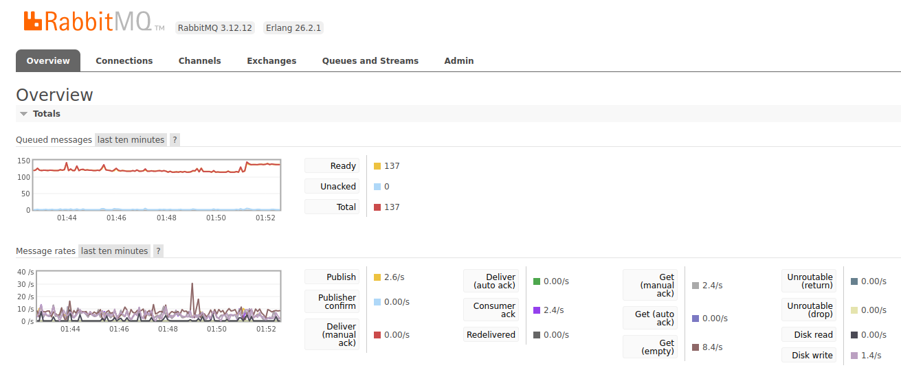
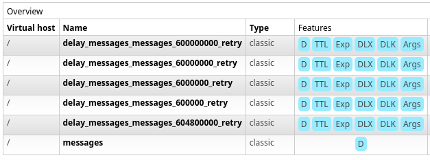
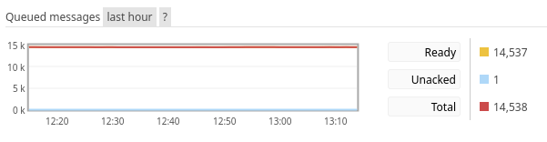
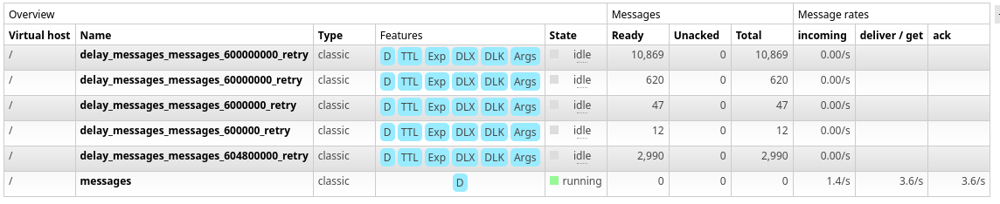
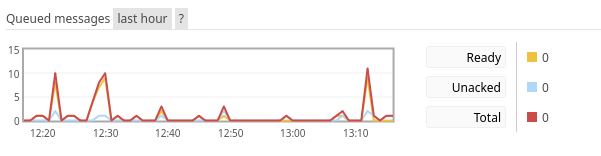
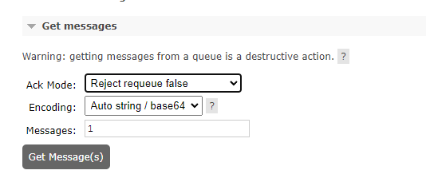

# FAQ

See below our Frequently Asked Questions (FAQ). The questions (and corresponding answers) below are in random order.

## Where can I find more info about AP?

There exists an official [ActivityPub specification](https://www.w3.org/TR/activitypub/), as well as [several AP extensions](https://codeberg.org/fediverse/fep/) on this specification.

There is also a **very good** [forum post on activitypub.rocks](https://socialhub.activitypub.rocks/t/guide-for-new-activitypub-implementers/479), containing a lot of links and resources to various documentation and information pages.

## How to setup my own Mbin instance?

Have a look at our guides. A bare metal/VM setup is **recommended** at this time, however we do provide a Docker setup as well.

## I have an issue!

You can [join our Matrix community](https://matrix.to/#/#mbin:melroy.org) and ask for help, and/or make an [issue ticket](https://github.com/MbinOrg/mbin/issues) in GitHub if that adds value (always check for duplicates).

See also our [contributing page](../03-contributing/README.md).

## How can I contribute?

New contributors are always _warmly welcomed_ to join us. The most valuable contributions come from helping with bug fixes and features through Pull Requests.
As well as helping out with [translations](https://hosted.weblate.org/engage/mbin/) and documentation.

Read more on our [contributing page](../03-contributing/README.md).

Do _not_ forget to [join our Matrix community](https://matrix.to/#/#mbin:melroy.org).

## What is Matrix?

Matrix is an open-standard, decentralized, and federated communication protocol. You can the [download clients for various platforms here](https://matrix.org/ecosystem/clients/).

As a part of our software development and discussions, Matrix is our primary platform.

## What is Mercure?

Mercure is a _real-time communication protocol_ and server that facilitates server-sent _events_ for web applications. It enables _real-time updates_ by allowing clients to subscribe and receiving updates pushed by the server.

Mbin uses Mercure (optionally), on very large instances you might want to consider disabling Mercure whenever it _degrades_ our server performance.

## What is Redis?

Redis is a _persinstent key-value store_, which can help for caching purposes or other storage requirements. We **recommend** to setup Redis when running Mbin, but Redis is optional.

## What is RabbitMQ?

RabbitMQ is an open-source _message broker_ software that facilitates the exchange of messages between different server instances (in our case ActivityPub messages), using queues to store and manage messages.

We highly **recommend** to setup RabbitMQ on your Mbin instance, but RabbitMQ is optional. Failed messages are no longer stored in RabbitMQ, but in PostgreSQL instead (table: `public.messenger_messages`).

## How do I know Redis is working?

Execute: `sudo redis-cli ping` expect a PONG back. If it requires authentication, add the following flags: `--askpass` to the `redis-cli` command.

Ensure you do not see any connection errors in your `var/log/prod.log` file.

In the Mbin Admin settings, be sure to also enable Mercure:


When you visit your own Mbin instance domain, you can validate whether a connection was successfully established between your browser (client) and Mercure (server), by going to the browser developer toolbar and visit the "Network" tab.

The browser should successfully connect to the `https://<yourdomain>/.well-known/mercure` URL (thus without any errors). Since it's streaming data, don't expect any response from Mercure.

## How do I know RabbitMQ is working?

Execute: `sudo rabbitmqctl status`, that should provide details about your RabbitMQ instance. The output should also contain information about which plugins are installed, various usages and on which ports it is listening on (eg. `5672` for AMQP protocol).

Ensure you do not see any connection errors in your `var/log/prod-{YYYY-MM-DD}.log` file.

Talking about plugins, we advise to also enable the `rabbitmq_management` plugin by executing:

```sh
sudo rabbitmq-plugins enable rabbitmq_management
```

Let's create a new admin user in RabbitMQ (replace `<user>` and `password` with a username & password you like to use):

```sh
sudo rabbitmqctl add_user <user> <password>
```

Give this new user administrator permissions (`-p /` is the virtual host path of RabbitMQ, which is `/` by default):

```sh
# Again don't forget to change <user> to your username in the lines below
sudo rabbitmqctl set_user_tags <user> administrator
sudo rabbitmqctl set_permissions -p / <user> ".*" ".*" ".*"
```

Now you can open the RabbitMQ management page: (insecure connection!) `http://<server-ip>:15672` with the username and the password provided earlier. [More info can be found here](https://www.rabbitmq.com/management.html#getting-started). See screenshot below of a typical small instance of Mbin running RabbitMQ management interface ("Queued message" of 4k or even 10k is normal after recent Mbin changes, see down below for more info):



## Messenger Queue is building up even though my messengers are idling

We recently changed the messenger config to retry failed messages 3 times, instead of sending them straight to the `failed` queue.
RabbitMQ will now have new queues being added for the different delays (so a message does not get retried 5 times per second):



The global overview from RabbitMQ shows the ready messages for all queues combined. Messages in the retry queues count as ready messages the whole time they are in there,
so for a correct ready count you have to go to the queue specific overview.

| Overview                                                | Queue Tab                                         | "Message" Queue Overview                                          |
| ------------------------------------------------------- | ------------------------------------------------- | ----------------------------------------------------------------- |
|  |  |  |

## RabbitMQ Prometheus exporter

See [RabbitMQ Docs](https://rabbitmq.com/prometheus.html)

If you are running the prometheus exporter plugin you do not have queue specific metrics by default.
There is another endpoint with the default config that you can scrape, that will return queue metrics for our default virtual host `/`: `/metrics/detailed?vhost=%2F&family=queue_metrics`

Example scrape config:

```yaml
scrape_configs:
  - job_name: "mbin-rabbit_queues"
    static_configs:
      - targets: ["example.org"]
    metrics_path: "/metrics/detailed"
    params:
      vhost: ["/"]
      family:
        [
          "queue_coarse_metrics",
          "queue_consumer_count",
          "channel_queue_metrics",
        ]
```

## How to clean-up all failed messages?

If you want to delete all failed messages (`failed` queue) you can execute the following command:

```bash
./bin/console mbin:messenger:failed:remove_all
```

And if you want to delete the dead messages (`dead` queue) you can execute the following command:

```bash
./bin/console mbin:messenger:dead:remove_all
```

_Hint:_ Most messages that are stored in the database are most likely in the `failed` queue, thus running the first command (`mbin:messenger:failed:remove_all`) will most likely delete all messages in the `messenger_messages` table. Regularly running this command will keep your database clean.

## Where can I find my logging?

You can find the Mbin logging in the `var/log/` directory from the root folder of the Mbin installation. When running production the file is called `prod-{YYYY-MM-DD}.log`, when running development the log file is called `dev-{YYYY-MM-DD}.log`.

See also [troubleshooting (bare metal)](./05-troubleshooting/01-bare_metal.md).

## Should I run development mode?

**NO!** Try to avoid running development mode when you are hosting our own _public_ instance. Running in development mode can cause sensitive data to be leaked, such as secret keys or passwords (eg. via development console). Development mode will log a lot of messages to disk (incl. stacktraces).

That said, if you are _experiencing serious issues_ with your instance which you cannot resolve by looking at the log file (`prod-{YYYY-MM-DD}.log`) or server logs, you can try running in development mode to debug the problem or issue you are having. Enabling development mode **during development** is also very useful.

## I changed my .env configuration but the error still appears/new config doesn't seem to be applied?

After you edited your `.env` configuration file on a bare metal/VM setup, you always need to execute the `composer dump-env` command (in Docker you just restart the containers).

Running the `post-upgrade` script will also execute `composer dump-env` for you:

```bash
./bin/post-upgrade
```

**Important:** If you want to switch between `prod` to `dev` (or vice versa), you need explicitly execute: `composer dump-env dev` or `composer dump-env prod` respectively.

Followed by restarting the services that are depending on the (new) configuration:

```bash
# Clear PHP Opcache by restarting the PHP FPM service
sudo systemctl restart php8.4-fpm.service

# Restarting the PHP messenger jobs and Mercure service (also reread the latest configuration)
sudo supervisorctl reread && sudo supervisorctl update && sudo supervisorctl restart all
```

## How to retrieve missing/update remote user data?

If you want to update all the remote users on your instance, you can execute the following command (which will also re-download the avatars):

```bash
./bin/console mbin:ap:actor:update
```

_Important:_ This might have quite a performance impact (temporarily), if you are running a very large instance. Due to the huge amount of remote users.

## Running `php bin/console mbin:ap:keys:update` does not appear to set keys

If you're seeing this error in logs:

> getInstancePrivateKey(): Return value must be of type string, null returned

At time of writing, `getInstancePrivateKey()` [calls out to the Redis cache](https://github.com/MbinOrg/mbin/blob/main/src/Service/ActivityPub/ApHttpClient.php#L348)
first, so any updates to the keys requires a `DEL instance_private_key instance_public_key` (or `FLUSHDB` to be certain, as documented here: [bare metal](04-running-mbin/03-upgrades.md#clear-cache) and [docker](04-running-mbin/03-upgrades.md#clear-cache-1))

## RabbitMQ shows a really high publishing rate

First thing you should do to debug the issue is looking at the "Queues and Streams" tab to find out what queues have the high publishing rate.
If the queue/s in question are `inbox` and `resolve` it is most likely a circulating `ChainActivityMessage`.
To verify that assumption:

1. stop all messengers
   - if you're on bare metal, as root: `supervisorctl stop messenger:*`
   - if you're on docker, inside the `docker` folder : `docker compose down messenger*`
2. look again at the publishing rate. If it has gone down, then it definitely is a circulating message

To fix the problem:

1. start the messengers if they are not already started
2. go to the `resolve` queue
3. open the "Get Message" panel
4. change the `Ack Mode` to `Automatic Ack`
5. As long as your publishing rate is still high, press the `Get Message` button. It might take a few tries before you got all of them and you might get a "Queue is empty" message a few times

### Discarding queued messages

If you believe you have a queued message that is infinitely looping / stuck, you can discard it by setting the `Get messages` `Ack mode` in RabbitMQ to `Reject requeue false` with a `Messages` setting of `1` and clicking `Get message(s)`.

> [!WARNING]
> This will permanently discard the payload



## Performance hints

- [Resolve cache images in background](https://symfony.com/bundles/LiipImagineBundle/current/optimizations/resolve-cache-images-in-background.html#symfony-messenger)

## References

- [https://symfony.com/doc/current/setup.html](https://symfony.com/doc/current/setup.html)
- [https://symfony.com/doc/current/deployment.html](https://symfony.com/doc/current/deployment.html)
- [https://symfony.com/doc/current/setup/web_server_configuration.html](https://symfony.com/doc/current/setup/web_server_configuration.html)
- [https://symfony.com/doc/current/messenger.html#deploying-to-production](https://symfony.com/doc/current/messenger.html#deploying-to-production)
- [https://codingstories.net/how-to/how-to-install-and-use-mercure/](https://codingstories.net/how-to/how-to-install-and-use-mercure/)
