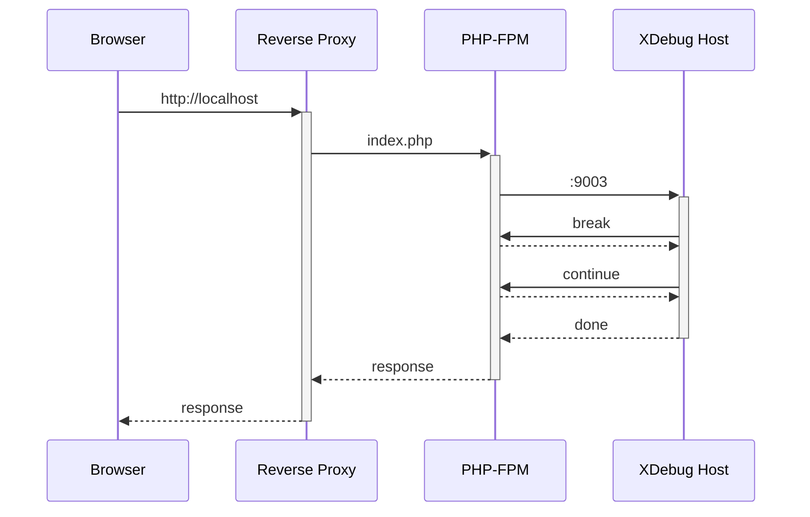

# Docker

Using docker can get you up and running quickly as it spins up containers of all the required components.

## Supported operating systems

 - Linux

## Requirements

 - [Docker](https://docs.docker.com/get-docker/)

## Quickstart

The development environment is run with [docker compose].

```shell
# Create a symbolic link to the dev setup that merges and overrides part of compose.yml
ln -nfs compose.dev.yml compose.override.yml
# Create a symbolic link to the configuration for the dev setup
ln -nfs .env.dev_docker .env
# Bring up all the services and detach from the console
docker compose up -d
```

Once everything has started, you can navigate to http://localhost:8008. Here's a [docker compose cheatsheet]

### Alternatives for getting started

Should you want to edit the `compose.override.yml` file without making changes to `compose.dev.yml`, read further.
Your changes will be ignored by git.

#### Use the `include` directive

For docker versions `>= 2.20.0`, you can [include][docker compose include] other YAML files into a compose file.
This has the benefit of keeping up to date with changes to the `compose.dev.yml` without modifying it.

_compose.override.yml_
```yaml
include:
  - compose.dev.yml
  - compose.dev.override.yml # Modifications go into that file
```

#### Copy the compose.dev.yml

Instead of linking, copy the `compose.dev.yml` to `compose.override.yml` and make your changes.

The downside of this approach is that changes and fixes to `compose.dev.yml` from version control will not reflect
in your compose setup automatically.

## How it works

Mbin depends on multiple services (PostgreSQL, Redis, a reverse proxy, PHP, ...). Instead of having one monolithic
docker image that includes these services and all their configs, the services each run in their own containers.

There's minimal overlap between most services and their `Dockerfile`s. Here are a few things to know.

### Split compose file

Instead of having one large compose file to cater to every need, there are multiple - the main one being `compose.yml`.
This takes advantage of [merging][docker compose merging]. Merging is done automatically when a `compose.override.yml`
is present, otherwise the list of files has to be passed with `docker compose -f compose.yml -f file1.yml -f file2.yml`.

### php/Dockerfile

[This][php-dockerfile] is the biggest and most complex `Dockerfile` in the repo.
It's a multi-stage file that attempts to make the final image minimal. You can read it, but the most important things
to keep in mind are:

- the `base` target only has the minimal common items for the next steps
- for production there are builder targets to build the frontend and backend of mbin
- for development, the `dev` target is minimal as the frontend and backend are built when the services are first run 
- the final target is `prod` which unites the outputs of the builder targets

### Building the frontend and backend

As mentioned [above](#phpdockerfile), the front and backend are built in the `Dockerfile` for production.

In development, this is taken care of at runtime in [compose.dev.yml]. The `messenger` service is the first PHP
service to run, so it installs PHP dependencies and such. The `node` service is only in the dev compose not production
and requires files from the PHP dependencies to successfully build the frontend. It is thus run afterward.


## Frequently executed tasks

### Modifying behavior with a quick turn-around

The entire repository is mounted into the `caddy`, `php`, and `messenger` services.

#### PHP code

Most PHP code changes are picked up immediately after refreshing the page in the browser.

#### Other important files

| file          | services       | how to refresh                                                         |
|---------------|----------------|------------------------------------------------------------------------|
| Caddyfile     | caddy          | `docker compose exec caddy caddy reload --config /etc/caddy/Caddyfile` |
| entrypoint.sh | php, messenger | `docker compose up -d --no-deps $service`                              |


### Debugging PHP (XDebug)

PHP supports remote debugging using [XDebug](https://xdebug.org/). This works by hosting an Xdebug server the php
process can call. 



#### Requirement

An XDebug server. The XDebug server is often hosted on port 9000 or 9003. Some IDEs (like [PHPStorm]) have it builtin.

#### Enabling

Open [app.dev.ini] and uncomment `;xdebug.start_with_request=yes` by removing the `;`, 
then restart the `php` service using `docker compose restart php`.

Once you navigate to a page, your IDE/editor should get called from `php-fpm` within docker.

#### Special cases

Firewalls can sometimes get in the way of communication between the docker container and the docker host.

##### NixOS

Nixos needs [iptables rules](https://discourse.nixos.org/t/docker-container-not-resolving-to-host/30259/8).

[app.dev.ini]: ../../docker/php/conf.d/app.dev.ini
[compose.dev.yml]: ../../compose.dev.yml
[docker compose]: https://docs.docker.com/compose/reference/
[docker compose cheatsheet]: https://devhints.io/docker-compose
[docker compose include]: https://docs.docker.com/compose/compose-file/14-include/
[docker compose merging]: https://docs.docker.com/compose/compose-file/13-merge/
[php-dockerfile]: ../../docker/php/Dockerfile
[PHPStorm]: https://www.jetbrains.com/phpstorm/
